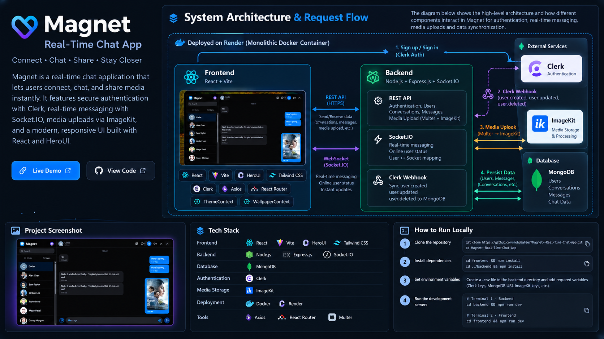

# 🧲 Magnet — Real-Time Chat App

<p align="center">
  <b>A modern real-time chat application for connecting, messaging and sharing media instantly.</b>
</p>

<p align="center">
  <a href="https://magnet-real-time-chat-app.onrender.com/">
    🚀 Live Demo
  </a>
  &nbsp;&nbsp;•&nbsp;&nbsp;
  <a href="https://github.com/mohdsafee7/Magnet--Real-Time-Chat-App">
    💻 Source Code
  </a>
</p>

---

## 📌 About the Project

**Magnet** is a full-stack real-time chat application built to provide fast and interactive communication between users.

The application supports real-time messaging, online user presence, secure authentication, image sharing, user search and customizable themes/wallpapers.

The backend is built with **Node.js, Express.js and Socket.IO**, while **MongoDB** is used for persistent data storage. **Clerk** handles authentication and user synchronization, while **ImageKit** is used for media processing and storage.

The application is containerized using **Docker** and deployed as a monolithic web service on **Render**.

---

## ✨ Features

- 🔐 Secure authentication with **Clerk**
- 💬 Real-time one-to-one messaging with **Socket.IO**
- ⏰ **Message reminders** with scheduled in-app notifications
- 🟢 Real-time **online/offline user status**
- 🖼️ Image/media sharing using **ImageKit**
- 👤 Automatic Clerk user synchronization through webhooks
- 🔎 Search users and start conversations
- 🎨 Theme customization
- 🖼️ Custom chat wallpapers
- 📱 Responsive and modern UI
- ⚡ REST APIs for application data
- 🐳 Dockerized application
- ☁️ Deployed on Render

---

## 🏗️ System Architecture

The following diagram shows the high-level architecture of Magnet and how the frontend, backend, authentication, database, real-time communication and media services interact.



### Request Flow

```text
                    ┌──────────────────────┐
                    │       User           │
                    └──────────┬───────────┘
                               │
                               ▼
                    ┌──────────────────────┐
                    │ React + Vite Client  │
                    └──────────┬───────────┘
                               │
                 ┌─────────────┴─────────────┐
                 │                           │
                 ▼                           ▼
          REST API Requests            Socket.IO
                 │                           │
                 ▼                           ▼
        ┌─────────────────┐        ┌─────────────────┐
        │ Express Backend │        │ Real-Time Server│
        └────────┬────────┘        └────────┬────────┘
                 │                          │
        ┌────────┴─────────┐                │
        │                  │                │
        ▼                  ▼                ▼
    MongoDB             ImageKit       Online Status
        │
        │
        ▼
   Users / Messages /
   Conversations

Authentication Flow:

React Client → Clerk → Clerk Webhook → Express → MongoDB
````

---

## 🛠️ Tech Stack

### Frontend

* **React**
* **Vite**
* **HeroUI**
* **Tailwind CSS**
* **React Router**
* **Axios**
* **Socket.IO Client**

### Backend

* **Node.js**
* **Express.js**
* **Socket.IO**
* **Node-Cron** — Scheduled reminder processing
* **Multer**

### Database & Services

* **MongoDB**
* **Clerk** — Authentication & Webhooks
* **ImageKit** — Image/media storage and processing

### Deployment & Tools

* **Docker**
* **Render**
* **Git & GitHub**
* **VS Code**

---

## 🔄 How It Works

### 1. Authentication

Clerk handles user authentication.

```text
User
 ↓
Clerk
 ↓
Authentication
 ↓
Application
```

When a user is created or updated in Clerk, a webhook is sent to the backend.

```text
Clerk
 ↓
Webhook
 ↓
Express Backend
 ↓
MongoDB
```

This keeps the application's user collection synchronized with Clerk.

---

### 2. Real-Time Messaging

Socket.IO is used for real-time communication.

```text
User A
   │
   │ Send Message
   ▼
Socket.IO Server
   │
   ├──────► MongoDB
   │          │
   │          └── Store Message
   │
   └──────► User B
               │
               └── Message appears instantly
```

The Socket.IO server also maintains connected users and broadcasts online-user updates.

---

### 3. Image Sharing

Images are uploaded using `multipart/form-data`.

```text
React Client
     │
     ▼
Multer
     │
     ▼
ImageKit
     │
     ▼
Image URL
     │
     ▼
Message / MongoDB
     │
     ▼
Recipient
```

This allows media files to be stored through ImageKit while the application stores the relevant URL with the message.

---

### 4. Message Reminders

Magnet allows users to turn an important chat message into an actionable reminder without leaving the conversation.

Users can choose **10 minutes, 1 hour, tomorrow, or a custom date and time**. When the reminder becomes due, the backend processes it using a scheduled cron job and sends a real-time notification through Socket.IO.

```text
User selects a message
        ↓
      Remind me
        ↓
 Select reminder time
        ↓
 MongoDB stores reminder
        ↓
 Cron checks due reminders
        ↓
   Socket.IO event
        ↓
 🔔 In-app notification
        ↓
   Open message
        ↓
Conversation opens and the original message is highlighted.
```
Reminders are stored separately from the message and reference the user, message, conversation, due time, and processing status. This keeps the existing message structure unchanged while allowing reminders to be processed independently.

---

## 📂 Project Structure

```text
Magnet--Real-Time-Chat-App/
│
├── backend/
│   ├── src/
│   │   ├── controllers/
│   │   ├── middleware/
│   │   ├── models/
│   │   ├── routes/
│   │   └── index.js
│   └── package.json
│
├── frontend/
│   ├── src/
│   │   ├── components/
│   │   ├── context/
│   │   ├── pages/
│   │   └── ...
│   └── package.json
│
├── assets/
│   └── magnet-architecture.png
│
├── Dockerfile
├── .dockerignore
└── README.md
```

---

## 🚀 Run Locally

### 1. Clone the repository

```bash
git clone https://github.com/mohdsafee7/Magnet--Real-Time-Chat-App.git

cd Magnet--Real-Time-Chat-App
```

### 2. Install frontend dependencies

```bash
cd frontend
npm install
```

### 3. Install backend dependencies

```bash
cd ../backend
npm install
```

---

## 🔑 Environment Variables

Create a `.env` file inside the `backend` directory.

```env
PORT=8000

MONGODB_URI=your_mongodb_connection_string

CLERK_SECRET_KEY=your_clerk_secret_key
CLERK_WEBHOOK_SIGNING_SECRET=your_clerk_webhook_signing_secret

IMAGEKIT_PRIVATE_KEY=your_imagekit_private_key
IMAGEKIT_PUBLIC_KEY=your_imagekit_public_key
IMAGEKIT_URL_ENDPOINT=your_imagekit_url_endpoint
```

Create a `.env` file inside the `frontend` directory:

```env
VITE_CLERK_PUBLISHABLE_KEY=your_clerk_publishable_key
```

---

## ▶️ Run the Application

### Start Backend

Open a terminal:

```bash
cd backend
npm run dev
```

### Start Frontend

Open another terminal:

```bash
cd frontend
npm run dev
```

The frontend will normally be available at:

```text
http://localhost:5173
```

---

## 🐳 Docker Deployment

Magnet uses a **multi-stage Docker build**.

The frontend is first built using Vite, and the resulting production files are served by the Express backend.

```text
Frontend
   │
   │ Vite Build
   ▼
React Production Build
   │
   ▼
Docker Container
   │
   ├── Express Backend
   │
   └── React Static Files
   │
   ▼
Render
```

This allows the complete application to run as a **single deployed web service**.

---

## 🌐 Live Demo

### 🚀 [Open Magnet — Live Application](https://magnet-real-time-chat-app.onrender.com/)

---

## 💻 GitHub Repository

### [Magnet — Real-Time Chat App](https://github.com/mohdsafee7/Magnet--Real-Time-Chat-App)

---

## 🧠 What I Learned

While building Magnet, I worked with:

* Real-time communication using Socket.IO
* REST API development using Express.js
* Authentication using Clerk
* Webhook verification and event handling
* MongoDB data modeling
* Media uploads using Multer
* ImageKit integration
* React Context for global application state
* Real-time online user presence
* Scheduled background processing using cron jobs
* Building message-based reminder workflows with MongoDB and Socket.IO
* Docker multi-stage builds
* Production deployment using Render
* Environment variable management
* Debugging production build and deployment issues

---

## 🔮 Future Improvements

Some planned improvements include:

* Typing indicators
* Message read/delivery receipts
* Message pagination
* Web Push notifications for reminders when the browser/app is not actively open* Redis-based presence management
* Rate limiting
* Retry mechanisms
* Background job processing
* Automated testing
* CI/CD pipeline

---

## 👨‍💻 Author

**Mohd Safee**

<p>
  <a href="https://github.com/mohdsafee7">
    GitHub
  </a>
  &nbsp;•&nbsp;
  <a href="https://magnet-real-time-chat-app.onrender.com/">
    Live Project
  </a>
</p>

---

<p align="center">
  Built with ❤️ using React, Node.js, MongoDB & Socket.IO
</p>
